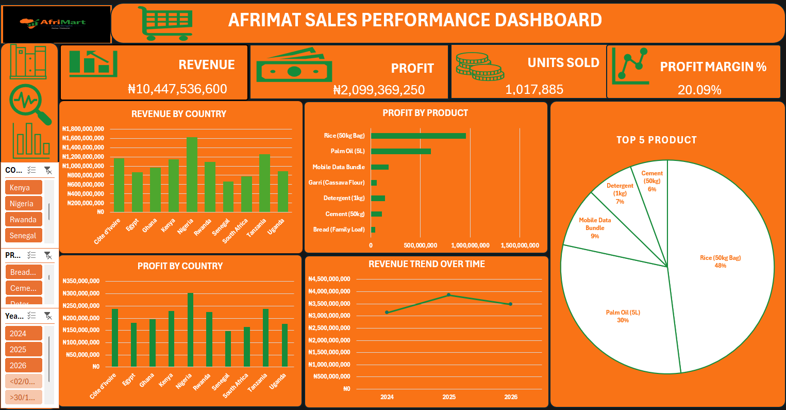

# Afrimart_Sales_Dashboard_OligbiPatience 

## Project Overview 
This project is an Excel Sales Performance Dashboard for Afrimart. 
The dashboard analyses sales data to provide insights into identifying the countries and products contributing most to Afrimart's overall sales and profitability, while allowing users to filter the analysis by country, product, and date.

The project demonstrates my ability to clean and organize data, perform analysis, create meaningful visualizations, and communicating business insights using Excel

---

## Business Questions Answered
- Which product generates the most profit?
- How has revenue changed over time?
- Which products contribute highly to the revenue?

---

## Key KPIs
-Total Revenue
-Total Profit
-Units Sold
-Profit Margin

---

## Tools Used
- Microsoft Excel
- Pivot Tables
- Pivot Charts
- KPIs
- Interactive Slicers
- Dashboard Design Technique

---

## Dashboard Preview

---

## Key Findings
- Nigeria generates the highest revenue and profit.
- Revenue increased from 2024 to 2025, then declined in 2026.
- Rice and Palm Oil dominates product Performance.

---

## Files In This Repository
- [Sales Dataset](AfriMart_Sales_Dataset.xlsx)
- [Dashboard Screenshot](AFRIMART_DASHBOARD.png)
- [Cleaned Data](Afrimart_Dashboard_OligbiPatience.xlsx)
- README.md

---

## Conclusion

This project demonstrates how raw sales data can be transformed into clear, interactive, and actionable business insights
that can support better sales monitoring and decision making.

